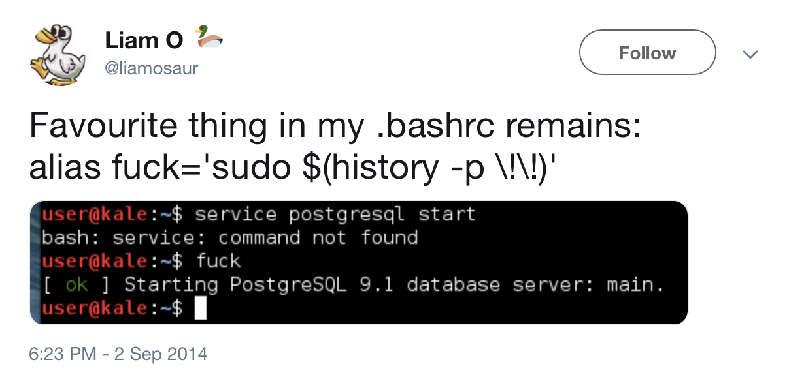

## Course Description

This course is an introduction to command line use both for basic everyday tasks and text processing. The course can be completed fully online, but live sessions and Slack-chat were a huge help during this adventure. I am also grateful for additional material on topics with a lot of very useful links to different online courses and other resources, a lot of them end up in my bookmarks and plans for future endeavours in Linux world.

Though I like digital note-taking but found that an old-school small paper notebook for writing down commands and their specifications worked best for me as I did not need to switch apps while watching or reading study material. Of course I will transfer everything to digital as soon as I have some spare time between other courses.

## Week 1 Introduction to Command Line Environments

This was an easy start for me as I did not need any additional preparations to get to a command line. Moreover, I have already done some small stuff using it.

We started with some pretty basic commands for everyday use. I knew some of them, but the need to repeat them for dozens of times during videos and tasks actually engraved them in me 😄 Tab and arrows use saved me a lot of typing (and nerves) for the whole course duration.

Incomplete list of studied commands:
- `pwd`
- `ls` and `tree`
- `cd`
- `mv` and `cp`
- `cat` and `less`
- `nano`
- `mkdir`
- `rm` and `rmdir`
- `wget`

... and a bunch of ways of quitting programs or processes.


## Week 2 Navigating a UNIX System

It was mostly about permissions. Finally I understood the numbers YouTube bloggers were throwing when speaking about permissions and why it is so important in Linux. Though number system is shorter I prefer to use letters with `chmod`, less possibilities to mess up.

Some basic info about process handling that I still do not comprehend much (mostly because I do not need to force kill processes on my machine) but at least I have notes 😄

Remote access via ssh was the scariest part! But it went surprisingly smoothly with a bit of confusion from shadow password input. But google is free 😄 Now I need only to input `ssh puhti` into the terminal and try not to mistype the password that I made unnecessary long.

Directory compression though understandable is still a bit messy (I just forget to `cd ..` before doing it).

## Week 3 Basic Corpus Processing

Now we are finally starting doing actual linguistic operations. I learned a lot about different encoding systems reading additional materials. The need of `doc2unix` was a surprise. I am happy Linux can do converting without additional fuzz. In Windows GUI it is not that easily done.

We were introduced to pipelines `|` and some essential text processing commands:
- `tr`
- `sort`
- `uniq`
- `wc`

And of course `grep` and `egrep` beasts of regular expressions. REs are cool and all but boy was it confusing. The printed cheatsheet was my hero during assignments and I still use it!

Here are some basic regular expressions I found userful to know:

Ancors | POSIX | Quantifiers | Groups & Ranges |
------ | ----- | ----------- | --------------- | 
**^** start of string | **[:upper:]** upper case letters | __*__ 0 or more | **.** any character |
**$** end of string | **[:lower:]** lower case letters| **?** 0 or 1 | **(a pipeline b)** a or b
**\b** word boundary | **[:alpha:]** all letters | **+** 1 or more | **[abc]** range (a or b or c)
**\<** start of word | **[:digits:]** digits |  | **[^abc]** not (a or b or c)
**\>** end of word | **[:punct:]** punctuation |  | **[a-q]** range from a to q
   | **[:blank:]** space and tab |  | **{m,n}** m to n repetitions

## Week 4 Advanced Corpus Processing

This week was about `sed`. I am still afraid of using it as am not confident in my knowledge. It is a rather complicated command this numbers of operators.

The most needed commands are:
- `'s/PATTERN/RESULT/' OLDFILE > NEWFILE` to get a file with changes made
- `'/PATTERN/d'` to delete the pattern
- `'/PATTERN/p'` to print lines with the pattern
- `-r` turns on regular expressions
- `-n` omit lines without the pattern
- if `g` is added after last / - include everything (only the first match is the default)

Looks easy but it was the lowest score for week assignment for me.

## Week 5 Scripting and Configuration Files

This week was fun! I love making my work more efficient. Scripts are all about this exact thing.

Though I like how my bash prompt looks like I experimented a bit with .bashrc. Not everything worked but I did not bother to google the problems. Surely I will research when I actually need to change the prompt appearance.

I like the clear error messages as I often forget to add some attributes. That is why I include them in every script in the assignment 😄

``` bash
#!/bin/bash
if [ $# -ne 1 ]     # for error message about lack of an argument
then
  echo "ERROR: Input an adjective as an argument to proceed"
  exit 1
fi
echo $1'er'
```

Also, if script has loops it is nice to receive a message the work is done!

``` bash
#!/bin/bash
file=$1  # needed file as the first attribute
if [ $# -ne 1 ]     # for error message about lack of a filename
then
  echo "ERROR: Input a filename to read"
  echo "$0 file_to_read"
  exit 1
fi
while read -r line
do
  echo $line
done < "$file"
echo "Task completed"     # just a satisfaction from a work done
```

A lot of ideas for automation but too little actual knowledge yet. Searching for additional tutorials is inevitable 😄

## Week 6 Installing and Running Programs

First of all, I need this alias 😄



This was a familiar topic as I use Linux for a while now. But I needed to take into account that my Fedora uses `yum` or `dnf` instead of `apt` so additional search and modifications of the commands.

`sudo dnf update` and `sudo dnf install PACKEGENAME`

Python virtual environments were a new concept.

`python -m venv VENVNAME` - to create a vertual envoronment

`sourse VENVNAME/bin/activate` - to activate it

`deactivate` when the work is done

During this week we installed packages through `pip` to work with python. The most important for linguists is of course `nltk` so `pip install nltk` it was. Everything was fine until bllipparser. I used puhti-server to do the tasks.

The most interesting part was working with Makefile where we combine scripts and get the needed results just typing `make all`. Neat! We were writing a Makefile to compile a corpus from some books which included frequency lists and sentence per line with deleted Gutenberg metadata. The logic is simple:

1. You define variable and provide souses
```bash
BOOKS=...(list of books)
FREQLISTS=$(BOOKS:%=results/%.freq.txt)
SENTEDBOOKS=$(BOOKS:%=results/%.sent.txt)
NO_MD_BOOKS=$(BOOKS:%=data/%.no_md.txt)
```
2. You identify options and attributes, for example `all`, `clean` etc.
3. You give the instructions in form: 

   **target**: **sourse**  
   commands to get to the target
```bash
# It can be python script:
    %.no_md.txt: %.txt  
        python3 src/remove_gutenberg_metadata.py $< > $@
# Bashscript: 
    results/%.freq.txt: data/%.no_md.txt 
        src/freqlist.sh $< > $@
# Or usual commands for bash:
    data/all.no_md.txt: $(NO_MD_BOOKS)
        cat $^ > $@
```
But you need to make sure your Makefile is in the right directory to actually work. I got problems after transfering it to different location. Otherwise, wonderful automation tool!

## Week 7 Version Control

This week was about all and mighty Git. I created a new account as an old one was long forgotten. This was the first time I actually created a repository and start working with it. Of course I faced an authentication problem! Thankfully the teacher helped and push works well since.

The work flow is the following:
1. `git init` from the folder to create a repository OR `git clone URL FOLDER` to copy a repository from Git to your machine.
2. `git branch BRANCHNAME` to create a separate branch to commit your changes not to mess with the original one
3. `git switch BRANCHNAME` to move to a branch
4. make changes to files (better some small chunks at a time)
5. `git status` OR `git diff` to show changes
6. `git add -A` to add everything to your commit OR `git add FILENAME` for adding files manually
7. `git commit -m "MESSAGE"` commit your changes locally, won't work without a message!
8. `git pull REPO BRANCHNAME` to get the changes from the repository before committing your part to remote.
9. `git push (REPO BRANCHNAME)` to push your changes to remote server
10. repeat untill everything is done and works fine
11. `git merge BRANCHNAME` to combine your branch with main one
12. `git branch -d BRANCHNAME` delete unneeded branch after merging

Simple right? Right?

It is all fun and games until you mess up, and you will do it at some point. This is where version control format of Git comes in handy! Here are some commands to undo commits:

- `git reset` rather total but still, if you add filename to it you can reset individual files. You can also add SHA of the last "good" commit to reset to that point
- `git log` command to get the list of all commits with their SHAs AND `git reflog` to see the history of changes for restoration
- `git revert SHA` undo specific commit

[More info about this see here](https://github.blog/2015-06-08-how-to-undo-almost-anything-with-git/)

I learned a lot but still not quite confident in using Git and GitHub. I often mess up commands, especially `git commit` I often forget about adding a message. But gradually I get more comfortable in using GitHub.

## Final Project GitHub Pages

All edits were done in KWrite, a default text editor in KDE Plazma. Neither Nano nor Emacs are my gem.

Creating a GitPage from a template is very easy. Some additional search for package names in dnf and everything works. Small changes to style are also not a problem. Just look through folders and files in your repository. Jekyll works fantastic. This is the reason I made commits quite rearly as I can just see all the changes right away without a hussle. I spent more time writing text on this page using [this cheatsheet for markdown format](https://github.com/adam-p/markdown-here/wiki/Markdown-Cheatsheet#links) than the installation and styling together!

Another headache is waiting with CV. LaTeX and Overleaf are rather new instruments for me but templates help a lot. No way can I make such a cool looking CV from scratch!

Hope you have enjoyed my rant! Have a nice day!
